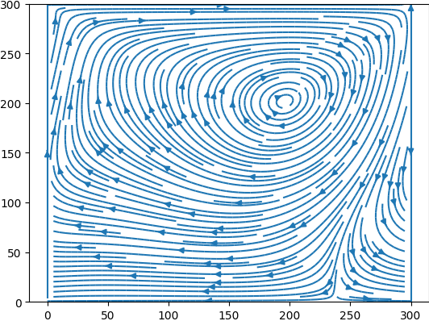
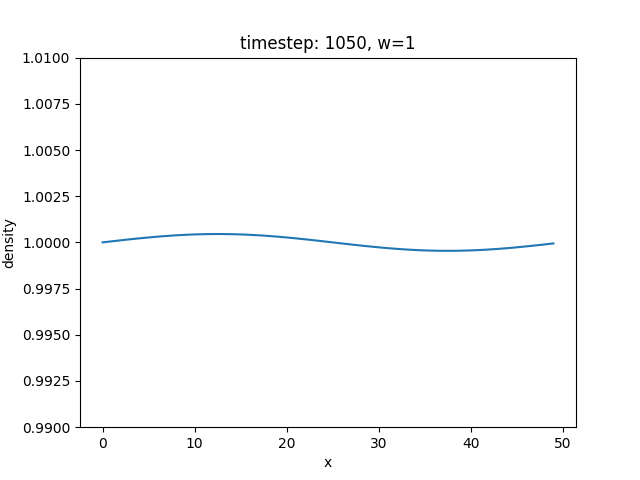
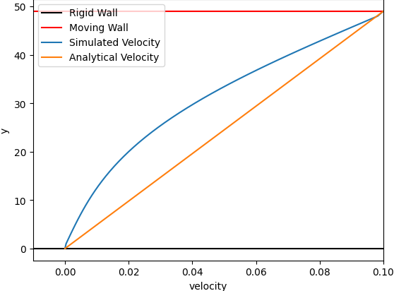
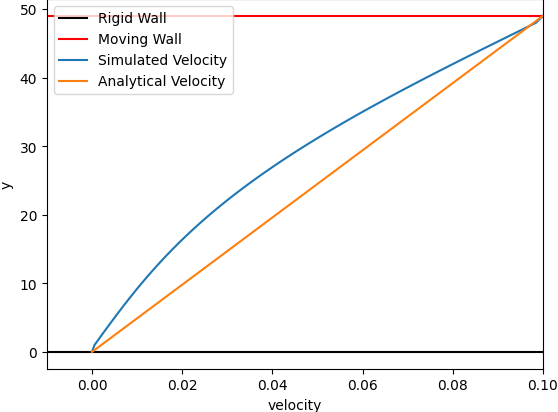
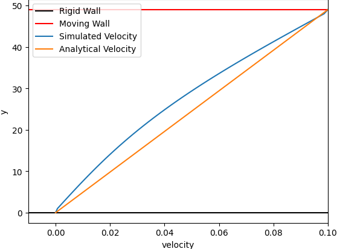

# Implementation of the Lattice Boltzmann method

`LB.py` in `src/parallelLB` contains the Lattice Boltzmann class which holds the relevant parameters such as the current state, omega, the grid size and the functions to simulate streaming and collision. `src/parallelLB/boundaries.py` contains the implementations of the boundary conditions. The code contains many explanatory comments.  
Analogously `src/seqLB` contains the sequential implementation. 

To run the simulations: 

 - Shear Wave Decay: `python /src/shearwave.py`
 - Couette Flow: `python /src/couetteflow.py`
 - Poiseuille Flow: `python /src/poiseuilleflow.py`
 - Sliding Lid: `python /src/slidinglid.py`
 - Sliding Lid with the parallel LB implementation (used to evaluate the efficiency of the parallelization): `mpiexec -n [number of workers] python .\src\slidinglidParallel.py`. Measures execution time and MLUPS. 

The parameters used in each simulation are defined at the top in the respective files and may be changed there. The default values for omega, Nx, Ny etc. are those used to create the plots shown in the report. The plots produced by each simulation can be found in `src/plots/{experiment name}`. 

### Example charts of the simulations 

#### Sliding lid 
||||
|:-:|:-:|:-:|
 Step 500 |  Step 2000 |  Step 5000
 Step 10000 |  Step 20000 |  Step 50000

#### Shear wave density decay
||||
|:-:|:-:|:-:|
 |  | 
 |  | 

#### Couette flow
||||
|:-:|:-:|:-:|
 |  | 
 |  | 

#### Poiseuille flow
||||
|:-:|:-:|:-:|
 |  | 
 |  | 

